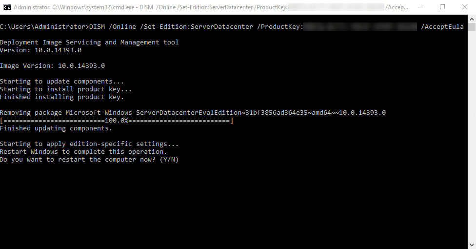

Title: Convert Windows 2016 Eval to Retail
---



Using your retail key with the ISO's downloaded from Microsoft's "Evaluation Center" should be easy right? You paid for a license so you should be able to just activate a trial... Turns out it's not that simple. You actually need to change your server edition from ServerBlahEvalEdition to whatever edition you have a key for using `dism`.

```
DISM /Online /Set-Edition:ServerDatacenter /ProductKey:<key for blah>
```

This command is going to yell at you for not accepting the EULA, so the final command looks like this:

```
DISM /Online /Set-Edition:ServerDatacenter /ProductKey:<key for blah> /AcceptEula
```

From what I gather the `Set-Edition` option can be either of the following:

- `ServerDatacenter`
- `ServerStandard`


The command takes a good 10 minutes to run (looks like it stalls), then asks to reboot to cleanup. Afterwards, you should be activated and ready. 

Have Fun!