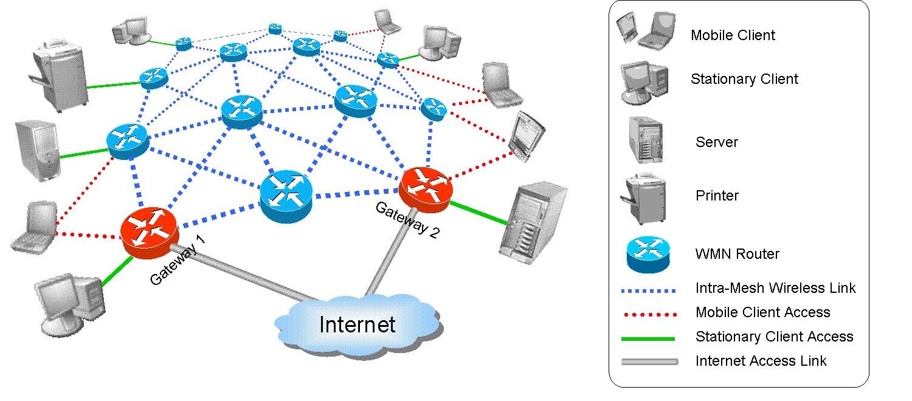

Title: Deploy a Tinc Mesh VPN Running TAP
Published: 25 Jul 14
---



I've used OpenVPN for several years now. The software is secure, stable, and has a great community - a prime example of Open Source at its best. OpenVPN is easily the best VPN software available. However, I recently moved to Tinc an Open Source alternative VPN. If OpenVPN was working great, why would I change to a completely new network?

The answer is amazingly simple - Tinc is a mesh network. I have servers across the United States - each one connected through this private network. With OpenVPN I would have to pass requests from one server to another through the OpenVPN master server. 

This sucks. Imagine if the OpenVPN server is in Florida, the two servers who want to talk to each other are located in California. These two servers have less than 1ms latency between them, but to chat they need to send their bits from California through 2,661 miles of (hopefully) glass, to Florida, and then back. If this journey takes 600 ms, that is an 599 ms overhead.

 Tinc solves this problem by using the mesh network strategy. In a mesh network, every node (rather than just the server and client) can relay traffic. Each node attempt direct connections to chat with one another. So instead of that 600ms round trip, I can hit < 1ms - a 600% improvement. If thats not a good reason, I don't know what is. 

In my small network (less than 20 nodes) Tinc is a perfect replacement to OpenVPN. Tinc provides the same security, the same TAP connections, is cross platform (Mac, Linux, Windows, Android), and is pretty stable (no issues so far). Although the documentation is rather lacking (took me a while to compile this tutorial). 

Interesting note, Tinc is lighter than OpenVPN and soooo much easier to configure, go figure... 

## Setting Up Tinc

This setup process will provide everything you need to setup Tinc using TAP. I assume the reader is using Ubuntu 14.04 LTS.  

I'm going to have two servers in this post - Obama and Mccain. They want to talk directly with each other. Neither will be the only a server, or only a client, both will be an equal peer.

To install Tinc I recommend getting the latest version. Right now Ubuntu is lagging behind, so I need to get the latest version though a `.deb`. The following uses 32-bit tinc. If you're running 64-bit use: ([http://mirrors.kernel.org/ubuntu/pool/universe/t/tinc/tinc_1.0.24-2.1_amd64.deb](http://mirrors.kernel.org/ubuntu/pool/universe/t/tinc/tinc_1.0.24-2.1_amd64.deb)).

If you can't find the correct packages from Ubuntu's Repo's checkout Debain's. Most of these will work without issues. 


```
# I like a clean workspace
cd /tmp

# The latest as of 7-25 is version 1.0.24. This is from an upstream build from 14.10. 
# Tinc has almost no dependencies, and is safe to install from upstream
wget http://launchpadlibrarian.net/179504313/tinc_1.0.24-2.1_i386.deb

# Install the package via dpkg
sudo dpkg -i tinc_1.0*.deb

# Fix any dependencies
apt-get install -f

# Clean up
rm tinc_1.0.24-2.1_i386.deb
```   


We should be good with the install. Do this for both servers. 

## Configure Tinc

First we need a "network name", this name separates nodes, and allows for multiple networks on the same network. In this tutorial I will call the network `master`, anywhere you see `master` here just change the name to what you decided. 

First we need to create a "network" configuration directory. For Tinc this is done by creating a folder in `/etc/tinc/`.

```
cd /etc/tinc
sudo mkdir master
sudo mkdir master/hosts
cd ./master
```

Each node must have at least two files, and an optional third - `tinc.conf`, `tinc-up`, and `tinc-down`, respectively. Lets make those now on each node. 

#### tinc.conf
```
# The name of the node, must be unique for the network 
Name = obama

# We live in modern dual stack IPv4/IPv6 times, use any
AddressFamily = any

# So we can use TAP
Device = /dev/net/tun

# Puts Tinc into TAP mode, also sets up routing tables
Mode = switch

# To what nodes should Tinc attempt to connect to
ConnectTo = mccain
#ConnectTo = obama
#ConnectTo = george
#ConnectTo = tom
#ConnectTo = henery
```

This one is for Obama, make sure to `name` the other server differently (Mccain). 

#### tinc-up
```
#!/bin/sh 
ifconfig $INTERFACE 10.6.0.1 netmask 255.255.0.0
```
Obama will have `10.6.0.1` as its address. Setup Mccain to something different (`10.6.0.2` would work). Make sure to include `#!/bin/sh`, else Tinc might have issues. 

#### tinc-down
```
#!/bin/sh 
ifconfig $INTERFACE down
```

Although not strictly required, this allows us to clean up after we shut down Tinc. 

We need to allow Tinc to execute these last two files. 

```
sudo chmod +x tinc-*
```
Now we need to make host files. These files point Tinc to each other, and allows direct connections. These files are safe and required to share around. 

Each node needs to make this locally. The format is simple. Name the host file after the local name give in the tinc.conf file. 

#### hosts/obama
```
Address = obama.example.com
Subnet = 10.0.0.0/16
```
That's all that is required in TAP switch mode. Routes are discovered automatically. `Address` tells Tinc where to look, luckily we can use a DNS name or IP address. `Subnet` tells Tinc where to automatically discover and is not strictly required. If you use a subnet, make sure that it's correct. 

Final step here is to generate private keys for every peer. On each node run this command to automatically do this. The `-k` generates the key for the local peer in the `master` network. 
```
sudo tincd -n master -K
```

After generating keys, make sure to share the updated host file for the local node. Take a look in it and you're see a public key directive was added by `tincd`. This allows nodes to authenticate each other with math! (I always get a kickout of that)

## Running Tinc

After we share the host files around we can start Tinc. 
```
sudo tincd -n master
``` 

`-n <network name>` is used to specify a particular (you can multiple networks on the same server).

To kill Tinc use `-k`. 
```
sudo tincd -n master -k
```

If there are no issues we can set Tinc to run on startup (and to obey the service commands).

Simple command:

```
sudo echo "master" >> nets.boot
```

Now we can use: `sudo service tincd restart`

At this point we should have two servers talking to each other over Tinc. No more need for a middleman server. 

> Update: Forgot the ConnectTo directive. 