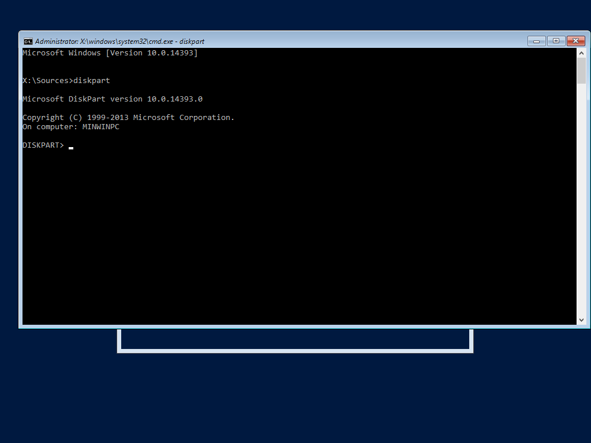
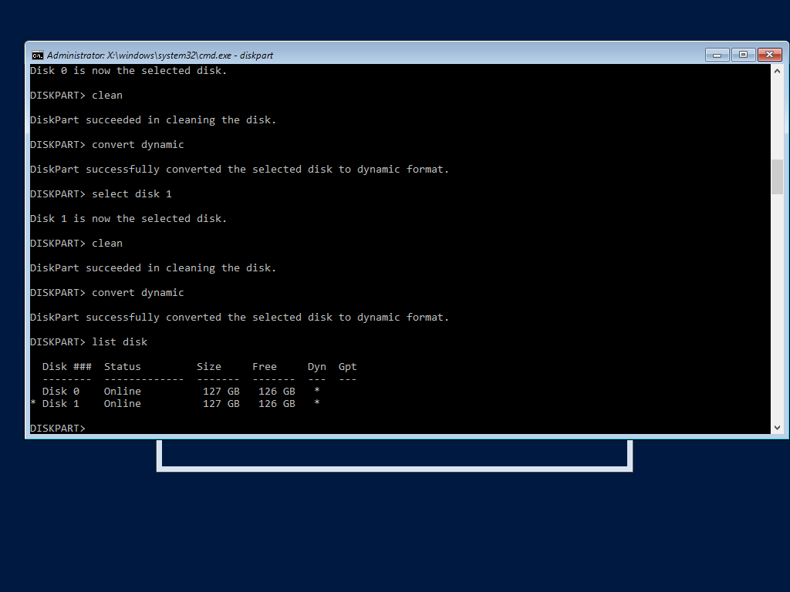
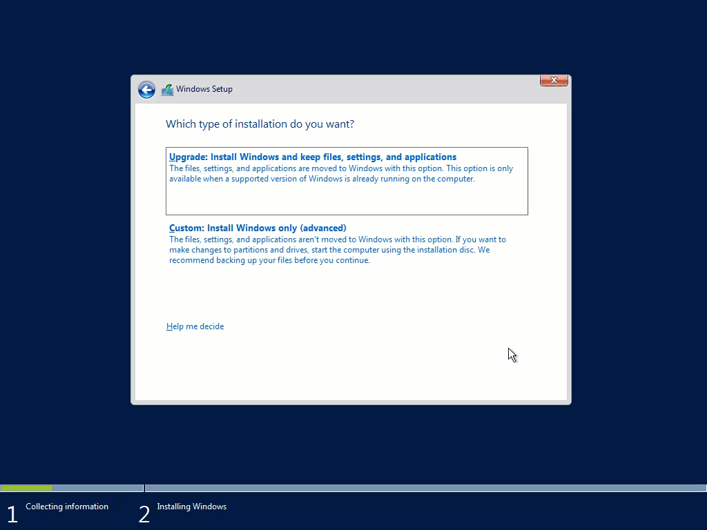

Title: Install Windows Server 2016 using Software RAID1
---

## Setup

Most Windows installers if not all modern versions have a command line option that can be accessed when using the GUI installer (from anywhere from what I can tell). This functionality can be accessed with `SHIFT + F10` and looks like:



From here we can access `diskpart`. From Microsoft's Technet, "DiskPart is a text-mode command interpreter [that] enables you to manage objects (disks, partitions, or volumes) by using scripts or direct input at a command prompt."

Think `parted` if you're coming from Linux - but with a lot more functionality. You might have used it under the name "Disk Management", which is basically a GUI wrapper. We will need this program to preparing the Windows installer to install to a RAID 1 setup.

To use Diskpart, invoke it from the command line using:

```
X:\Sources> diskpart
DISKPART> 
```

You can list all the disks available as so:

```
X:\Sources> diskpart
DISKPART> list disk

  Disk ###  Status         Size     Free     Dyn  Gpt
  --------  -------------  -------  -------  ---  ---
  Disk 1    Online          127 GB    127 B        
  Disk 2    Online          127 GB    127 B        

```
In the above example we have two disks, we will put both of these into our RAID1. As can be seen above, `diskpart` is base 0.

## Convert Each Disk to Dynamic

Any mirror setup requires disks to be in dynamic mode - this is basically LVM under Linux. Dynamic disks can be used for a multitude of purposes like disk spanning, mirroring, striping, etc. Although, be careful, there's no going back from dynamic without formatting the disks completely. 

Let's clean each disk before converting them, this uninitialize the disks without a partition scheme. After this disk is empty we enable dynamic mode.
```
DISKPART> select disk 0
DISKPART> clean
DISKPART> convert dynamic
```
And do the same thing with the second disk.
```
DISKPART> select disk 1
DISKPART> clean
DISKPART> convert dynamic
```

`list disk` should look like this now:



## Prepare Mirrors

At this point we can create our RAID1 "partitions". I use "partitions" in quotes as they aren't really partitions (as they mirror data) but the Windows installer must think of them as partitions. Little weird, but kind of makes sense. 

Windows requires two partitions when in MBR mode (EFI requires 3, which I won't go into). One which is normally called `System Reserved` and the main OS partition normally without a name (`C:/`). Both of these partitions need to be created manually as the normal Windows installer cannot.

```
DISKPART> select disk 0
DISKPART> create volume mirror disk=0,1 size=500
DISKPART> format quick fs=ntfs label="System Reserved"

```
These commands create a mirrored volume using disk `0` and `1` with a size of `500mb` (default size under Windows 2016). Then it formats the newly created (and automatically selected) volume using `ntfs` as the filesystem and "System Reserved" as the volume label.

Then we can create the OS partition using similar commands: 
```
DISKPART> select disk 0
DISKPART> create volume mirror disk=0,1
DISKPART> format quick fs=ntfs
```


Using `list volume` we should see the list of volumes that we created. Note that the volume numbers may be different.

## Make the Mirrors Usable

In the above setup, each volume represents a single logical "partition", but in reality each of these volumes spans two physical drives. These volumes are great under Windows, but not so useful to the BIOS attempting to bootstrap a OS. To make it possible for the BIOS to start Windows we need to create real partitions for each of our mirror volumes. 

First let's use `detail disk` to make sure we target the correct volumes.
```
DISKPART> select disk 0
DISKPART> detail disk
```

In the picture, `volume 0` is our `System Recovery` volume and `volume 1` is our OS volume, different configurations may be different.

```
DISKPART> select disk 0
DISKPART> select volume 1
DISKPART> retain
```
This creates a real partition for volume 0 (System Recovery) on disk 0. Use `list partition` to find to again make sure to target the correct partition.

```
DISKPART> select disk 0
DISKPART> list partition
```

Our `System Recovery` partition is `500 MB`, in this example, this partition is `partition 1`.

To mark the newly created, real partition to be the boot partition we can use the following:
```
DISKPART> select disk 0
DISKPART> select partition 2
DISKPART> active
```
We need to do the same thing on the other drive too, as so:

```
DISKPART> select disk 1
DISKPART> select volume 1
DISKPART> retain
DISKPART> select disk 1
DISKPART> select partition 2
DISKPART> active
```

We also need a partition for the OS drive (required by the installer). This can be done using the same commands:

```
DISKPART> select disk 0
DISKPART> select volume 0
DISKPART> retain
DISKPART> select disk 1
DISKPART> select volume 0
DISKPART> retain
```


At this point you can install Windows as normal to one of the mirror partitions.

## Postscript

Testing more with HyperV, I discovered that formating the mirrors using Windows setup was required to get a booting OS. I remember doing this before as the IPMI device I was using kept on crashing during installation - forcing me to restart the Windows installation.



## Considerations

- This method actually allows you to keep the "System Recovery" partition in sync under a mirror. Microsoft's official white paper on mirroring does provide support for this feature.
- This method also allows you to create a mirror on two drives with different sector sizes - although I personally think disallowing two different sector sizes should be a bug.
- You may need to make sure that you add the second drive as a boot device.