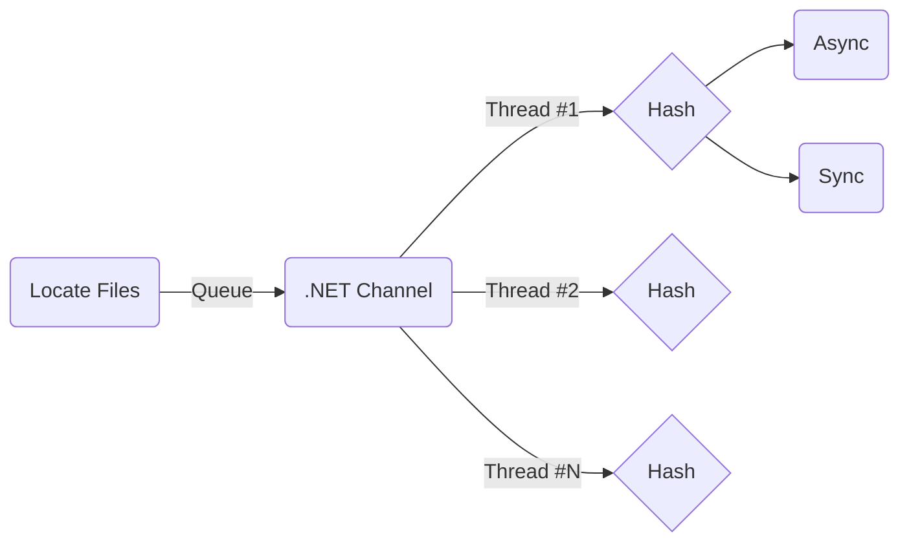

---
tags:
  - posts
title: Benchmarking Async Throughput
description: ...
draft: "true"
---
## Introduction

I've been writing a blog post about how async/await works - focusing mostly on the theory. I was at the point I needed some hard numbers. So here's the results from around 30-40 hours of both benchmarking and writing the benchmark...

My first attempt was to use [BenchmarkDotNet](https://github.com/dotnet/BenchmarkDotNet) - but I quickly ran into its single-threaded limitations (async/await tends to be slower when CPU bound, which BenchmarkDotNet would cause). Multi-threading isn't exactly a supported (or really, a great idea).

So then my second try was to load-test a ASP.NET Core API between two physical servers, connected with a 10Gbps link. This didn't work either as I got really inconsistent results (async was maybe 2% faster?). I looked at everything, from ensuring the hypervisor was offloading networking to my network card, to making sure neither client nor server were CPU bound (I was actually memory bound on the client side using [vegeta](https://github.com/tsenart/vegeta)).

After profiling, I discovered ASP.NET Core is basically async throughout - calling synchronous methods just calls the async counterpart, existing only for backwards compatibility at this point. So this wasn't going to work either.

So, then I looked towards disk IO, making a hashing benchmark. And again, I got really inconsistent results. After some debugging (and caffeine) I realized that the OS page cache was causing my benchmark to become CPU bound (completely breaking my attempt to benchmark non-blocking-IO....). After updating my code to clear the OS page cache, I found out I was still CPU bound, although, this time due to a combination of disk encryption and really fast NVMe drives (I use Samsung 980 Pro's in PCIe Gen4 slots).

So ultimately, I found consistent results from using a Samsung T7 portable SSD, which my benchmark maxed out at around 374Mib/s! I'm still amazed how for .NET has come, look at that memory and CPU usage!


## Methodology

Ultimately, I wanted to avoid as many caches as I could. This includes the OS cache, and any cache in the storage (DRAM cache) - so I'm only focusing on read operations. The benchmark is rather straightforward, but you can also read the [source code](https://github.com/Silvenga/async-throughput-playground).



Basically, I'm creating a thread-safe queue using a .NET Channel. The queue is read as quickly as possible by N workers, which execute the hashing operation in either sync or async mode.

The hashing code is rather simple, nothing really that special (using the new `HashData` methods!).

```csharp
public void Execute(CancellationToken cancellationToken = default)
{
    using var stream = File.Open(_filePath, FileMode.Open, FileAccess.Read, FileShare.None);
    _ = MD5.HashData(stream);
}

public async Task ExecuteAsync(CancellationToken cancellationToken = default)
{
    await using var stream = File.Open(_filePath, FileMode.Open, FileAccess.Read, FileShare.None);
    _ = await MD5.HashDataAsync(stream, cancellationToken);
}
```

I am using `_ = <blah>` syntax to avoid JIT/compiler optimizations around removing code that doesn't have side effects (the same reason BechmarkDotNet has you return objects). I also confirmed memory traffic is basically 0 - so GC-pauses shouldn't impact results.

My pluming is admittedly really wonky. I'm manually creating .NET threads to avoid Task scheduling oddities that I couldn't quite track down. In async mode, the threads don't do anything except spin-lock and then sleep (confirmed with profiling).

```csharp
return new Thread(() =>
{
    try
    {
        var worker = new TaskWorker(queue, options);
        var task = worker.Run(context, cancellationToken);
        if (!task.IsCompleted)
        {
            task.GetAwaiter().GetResult();
        }
    }
    catch (Exception e)
    {
        // Catch everything to avoid crashing the runtime from an exception thrown from an orphan thread.
        Console.WriteLine(e);
    }

    completionSource.SetResult();
});

```

But at the end of the day, the code can be ran directly using the CLI interface:

```powershell
# Prepare the directory (generate a bunch of random files).
dotnet run -c Release -- hash --input D:\tmp --rounds 10 --workers 128 --async

# Run 10 rounds in async mode.
dotnet run -c Release -- hash --input D:\tmp --rounds 10 --workers 128 --async

# Run 10 rounds in sync mode.
dotnet run -c Release -- hash --input D:\tmp --rounds 10 --workers 128
```

Running multiple rounds within the same runtime helps to avoid complexities with tiered compilation (the runtime optimizing hot paths).

## Results

So here's my results, and they are about what I would expect. As the number of threads increases, throughput for synchronous operations falls. When using async/await (enabling non-blocking IO), there's no measurable impact to throughput.

This is why async/await is awesome for scalability!


Effectively, throughput is the number of hashed 16MiB files. Each benchmark is from 10 rounds of hashing 512 files (8GiB per round). I tested this on a Windows 11 desktop machine with an Intel i7-11700K with a Samsung PSSD T7 drive (to ensure I was IO bound). I ran each benchmark twice to confirm my numbers were consistent.

And finally here's the raw data:

| Workers | Async    | Sync     |     |
| ------- | -------- | -------- | --- |
| 16      | 22.17353 | 22.11148 |     |
| 16      | 22.17236 | 22.10056 |     |
| 32      | 22.15123 | 19.47368 |     |
| 32      | 22.18913 | 19.46781 |     |
| 64      | 22.21379 | 16.50662 |     |
| 64      | 22.17615 | 16.49358 |     |
| 128     | 22.22632 | 13.412   |     |
| 128     | 22.23235 | 13.91639 |     |
