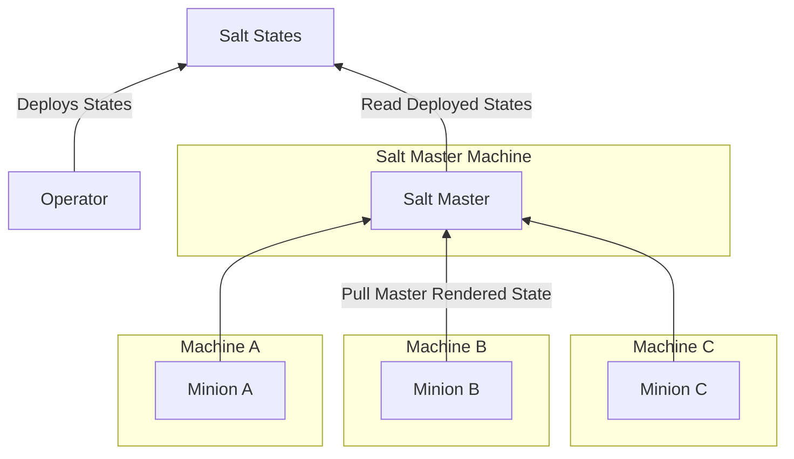
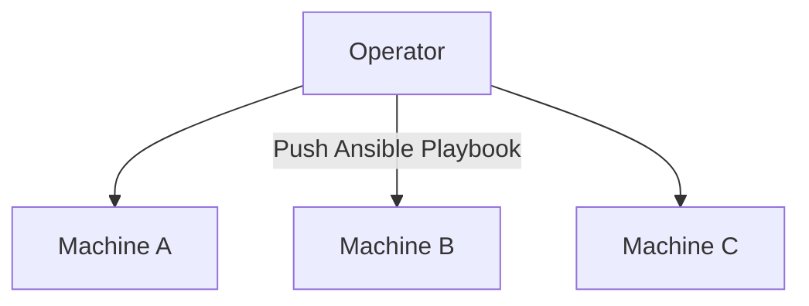

---
tags:
  - posts
title: Ansible from SaltStack - A Retrospective
description: ...
draft: "true"
---
## Introduction

I've been a SaltStack user for over 12 years (since 2014). I remember evaluating the different options back then, we basically had four main options at the time:

- Puppet
- Chef
- SaltStack
- Ansible

It was an exciting time then, with no clear winners. So most of us picked based on other factors e.g. platform compatibility, architecture, dislike of anything Puppet, etc. At the time, SaltStack was a clear winner to me, with some of the best docs and platform compatibility (I needed Windows support at the time).

It always felt like these projects were on a knife edge. They were massive, with very limited resources - Open Source always had a sustainability problem.

I remember when SaltStack first made the push to become profitable (around 2015, IIRC), in my mind, a healthy next step for the ecosystem. This was also when Chef was still very much the industry incumbent, along with Puppet - so it finally appeared that SaltStack was getting ready to displace the historical industry leaders!

Fast forward a decade, and the IaC space has completely changed:

- Puppet - Purchased by [Perforce](https://en.wikipedia.org/wiki/Perforce) in 2022.
- Chef - Purchased by [Progress](https://en.wikipedia.org/wiki/Progress_Software) in 2020.
- SaltStack - Purchased by [VMware](https://en.wikipedia.org/wiki/VMware) in 2020.
- Ansible - Purchased by [Red Hat](https://en.wikipedia.org/wiki/Red_Hat) in 2015, then Red Hat was purchased by [IBM](https://en.wikipedia.org/wiki/IBM) in 2019.

And I think stargazers make the outcome obvious - Ansible won in the end (Yellow).


## Why Ansible Won

Here I am, slowly migrating my personal stuff from SaltStack to Ansible. I wanted to do a post on why I'm liking Ansible, especially with my years of experience in SaltStack.

### Better Execution Model

First off, Ansible has always been quite a bit simpler from Salt, and this is immediately obvious when you look at its execution model:

**SaltStack:**



With Salt, any IoC changes must be deployed to the Master. I think it's rather common to use some form of GitOps, where the Salt Master(s) can read the desired state artifact directly from the Git repository. After the Master receives the artifact, then individual Salt Minions must pull from the Master and apply the state themselves. This allowed Salt to trivially scale to thousands of nodes (as applying state is distributed) and greatly simplified isolated networks (as Master nodes don't need to directly connect to Minions).

**Ansible:**



Ansible on the other hand pushes the desired state directly to nodes. My "mind blown" moment was when I finally understood Ansible (and stopped trying to fit it into a Salt shaped hole).

Ansible simply automates what a human would normally do.

These two models have fundamental philosophy differences, with their own pros and cons.

## Better Templating

Both Salt and Ansible both use Jinja2 templating, but how operators are expected to use templates is radically different.

**SaltStack:**

```yaml

Setup User {{ user }}:
  user.present:
    - name: {{ user }}

```

Salt deeply integrates Jinja templates to dynamically render states. In this example, looping simply uses templates to generate many `user.present` states. This is incredibly powerful and relatively easy to learn, and heavily used across official Salt states - but it's really easy for this kind of templating to become unmaintainable.

**Ansible:**

```yaml
- name: Setup several users
  ansible.builtin.user:
    name: "{{ item }}"
    state: present
  loop:
     - user1
     - user2
```

Ansible on the other hand much prefers tasks to be statically accessible - meaning Ansible tasks are almost always just normal, vanilla, YAML. YAML, that can be opened in any YAML editor successfully.

This constrained templating has the massive benefit that each file can be processed with static analysis (i.e. linting).

This is where Ansible really shines - especially when compared with Salt. Salt has some incredible flexibility, but this made building tooling SaltStack incredibly painful as developers would need to support a huge number of methods of doing the same thing (I even tried making a SaltStack [language server](https://en.wikipedia.org/wiki/Language_Server_Protocol) a couple times, all unsuccessfully).

Case-in-point, Ansible has a [freaking language server](https://github.com/ansible/vscode-ansible)!


### A Larger Ecosystem


## Summary

----
- A different execution model.
    - Automating a human, rather than submitting changes to a central master.
    - Better support for cloud resources.
- Less abstractions more encapsulation.
    - Saltstack tried to made less modules handle all platforms generically, this was problematic.
- Better templating.
    - Better generic editor support (true YAML vs a custom SLS format).
- Better dev ecosystem.
- Incremental adoption.
- Architecture
    - SSH Transport less of a problem.
    - Dependency management was easier.
