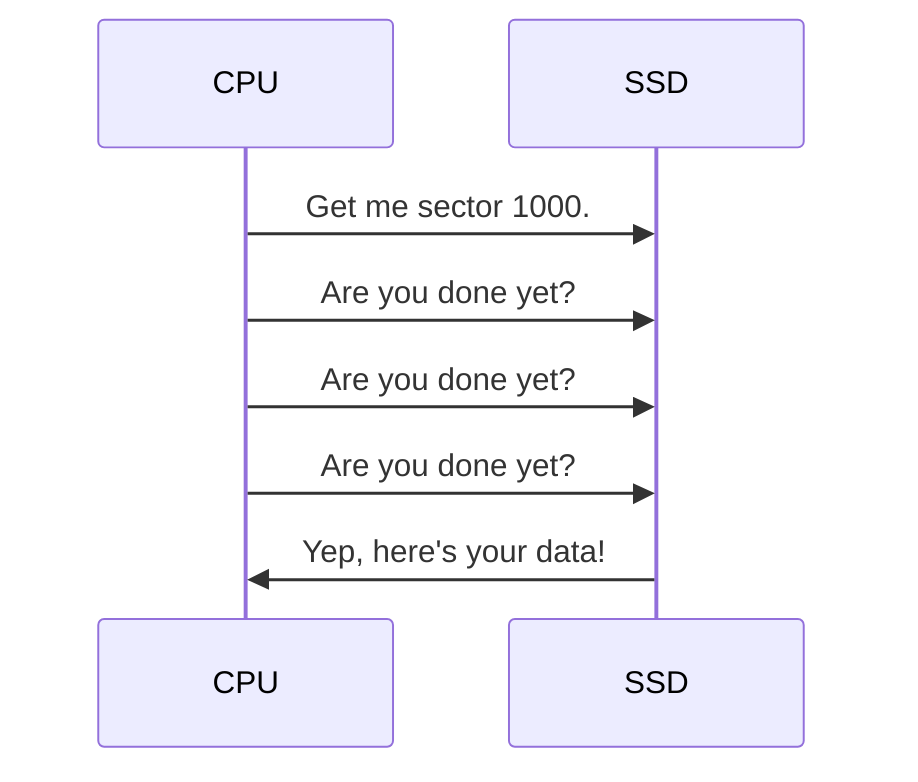
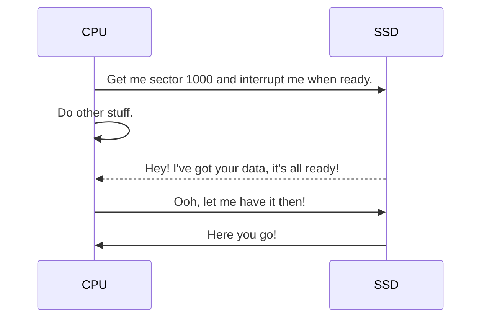
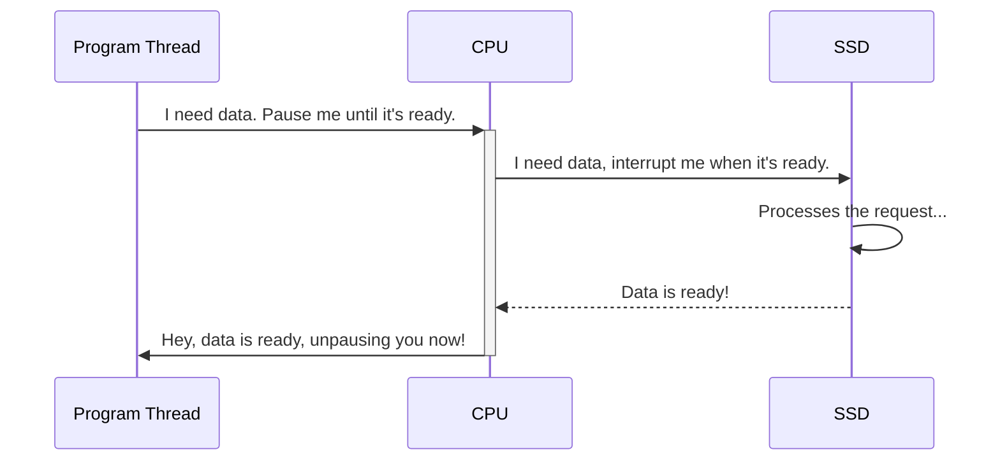

---
tags:
  - posts
  - javascript
  - typescript
  - dotnet
title: Why's and What's of Async/Await Programing
description: How async/await works, and clickbaity myths so I can justify writing actually useful stuff.
draft: "true"
---
## Introduction

I think language support for async/await continues to confuse a lot of developers, on all levels of experience. It actually kind of supprised me how old our current async/await implementation actually is.

- C# version 5 added support for async/await in 2012, after intubating as Async CTP (Community Technology Preview) in 2011.
- TypeScript introduced async/await in 2015, with the newly released version 1.7, with help from Anders Hejlsberg, lead architect of C#
- JavaScript got support with the release of ECMAScript 2017, likely taking inspiration from the wildly successful TypeScript (citation needed). Soon after, baseline status was reached the same year in 2017.

While C#'s async/await implementation can be traced all the way back to research papers in the 90's, I think the modern syntax iteration is much more important to concentrate on (which helps to avoid a language war, _me talking to any Java developer_ 😅).

## How Async/Await Works

Ultimately, async/await builds on a concept of using interrupts instead of polling. This isn't a new concept by any means, arguably it's one of the oldest ideas in computer science. Wikipedia notes one of the first system that used a concept of interrupts can be [dated to the 18-ton DYSEAC from 1954](https://en.wikipedia.org/wiki/Interrupt#History), made for the US Army. Interrupts were important, especially with early computers, because they just didn't have the CPU cycles to spare on polling.

The CPU is almost always going to have to wait for something. Even with our modern SSD's, they still just push electrons, which only can only travel as fast as light. This was even more true with tapes, where access latency was bound to moving physical parts through an atmosphere.

Let's illustrate this point by looking at what computers _don't_ do. This is an example of a polling implementation, where the CPU is asking the microprocessor in a SSD to fetch some data.

This **synchronous** polling is just waste CPU cycles, emitting heat without any tangible benefits.

This problem was ultimately solved by introducing a concept of an interrupt - a signal that "interrupts" currently executing code. So we can change that example above to be "interrupt driven":

As shown, this frees up the CPU to do other stuff, while the SSD **asynchronously** processes the request and prepares the data for the CPU. This is much more efficient as the CPU can do more "work" within the same constraints, since it's not constantly asking the SSD for a status update. If I were to personify the computer, I would say this is what the computer naturally "wants" to do.

Is this performance, free? No, because ultimately, computers are programmed by the flesh bags we call humans. Our brains do not currently have the ability to _consciously_ processes concurrent tasks. We tend to think in steps instead of the twisted web that is asynchronous programing, synchronous programing is more "natural" for us.

So how do we, [biological batteries for our computer overloads](https://en.wikipedia.org/wiki/The_Matrix), write programs that are natural to computers, while recognizing the limits of our own humanity? Well, for a long time, most developers didn't, or rather, we let the OS and hardware [abstract](https://en.wikipedia.org/wiki/Abstraction_(computer_science)) these concepts for the vast majority of code (arguable, but I'm making a point). We typically call this [preemptive-multitasking](https://en.wikipedia.org/wiki/Preemption_(computing)#Preemptive_multitasking) (which is a whole category of computer science).

With preemptive-multitasking, the OS/kernel, typically with help from the hardware, allows code to process tasks in a sequential order, including executing "naturally" asynchronous operations, such as IO operations - i.e., networking, disk access, etc. When code reaches these interrupt/event driven tasks, the code signals to the kernel that it wishes to sleep until that event has occurred.

In C# this could look like `Thread.Sleep(4_000)` or in Java `Thread.sleep(4000)`. Most languages have some concept of pausing or sleeping the current thread, which likely instructs the hardware to sleep the _physical_ thread (either directly, or indirectly through abstractions).

## Myths

### Async/Await Makes Code Faster

### Async/Await Makes Code Run in Parallel
