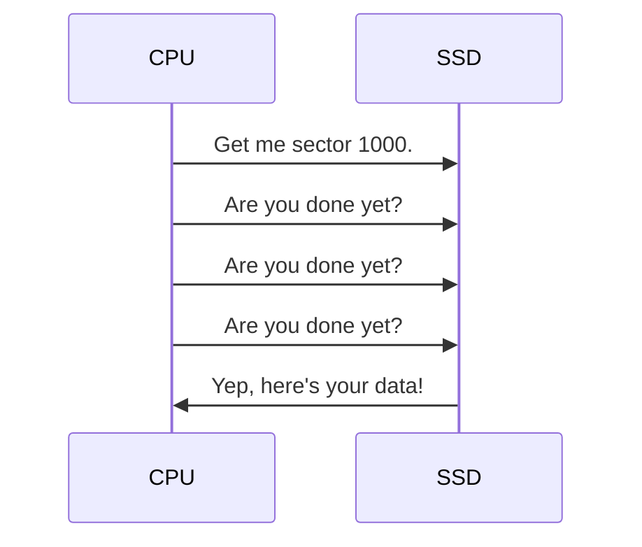
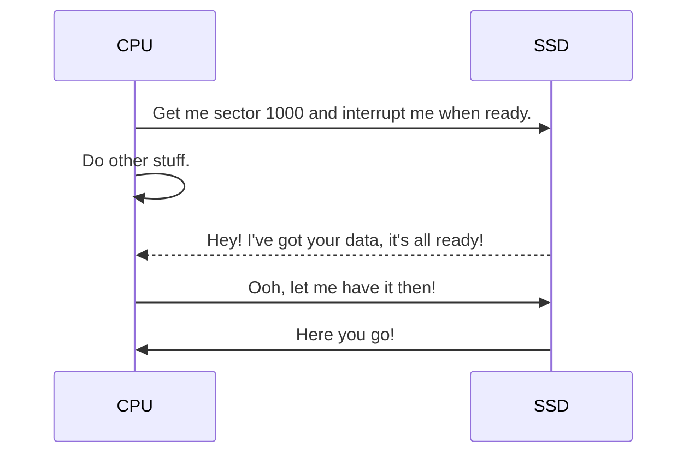
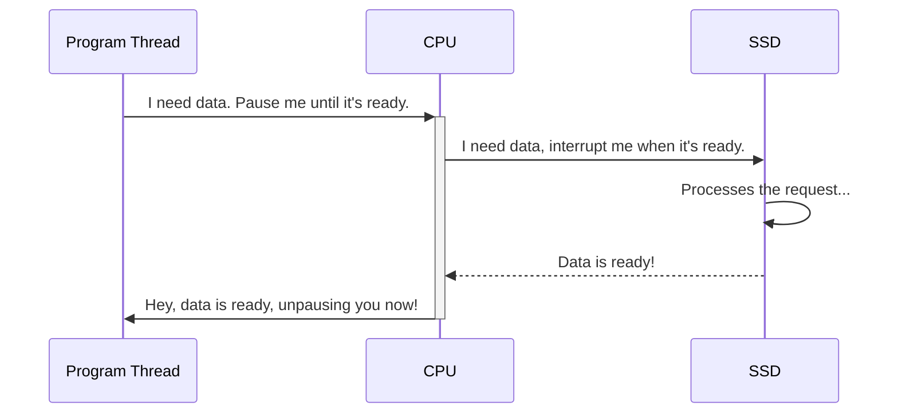
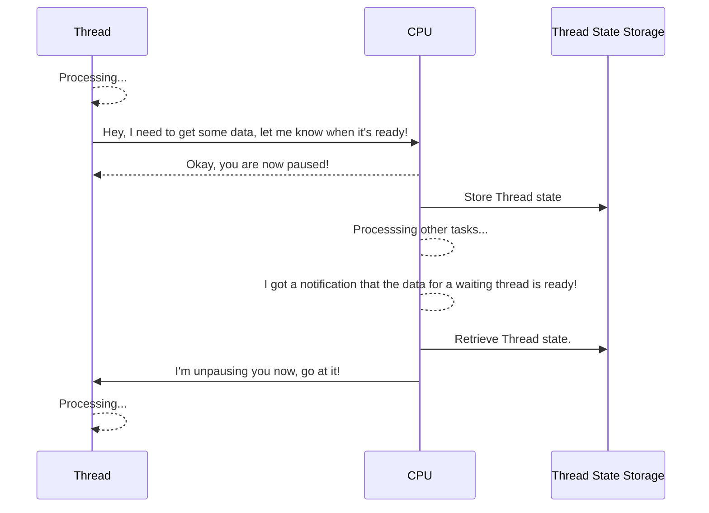

---
tags:
  - posts
  - javascript
  - typescript
  - dotnet
title: Why's and What's of Async/Await Programming
description: How async/await works, and clickbaity myths so I can justify writing actually useful stuff.
draft: "true"
---
## Introduction

I think language support for async/await continues to confuse a lot of developers, on all levels of experience. It actually kind of supprised me how old our current async/await implementation actually is.

- C# version 5 added support for async/await in 2012, after intubating as Async CTP (Community Technology Preview) in 2011.
- TypeScript introduced async/await in 2015, with the newly released version 1.7, with help from Anders Hejlsberg, lead architect of C#
- JavaScript got support with the release of ECMAScript 2017, likely taking inspiration from the wildly successful TypeScript (citation needed). Soon after, baseline status was reached the same year in 2017.

While C#'s async/await implementation can be traced all the way back to research papers in the 90's, I think the modern syntax iteration is much more important to concentrate on (which helps to avoid a language war).

## How Async/Await Works

### Standing on the Shoulders of Giants

Ultimately, async/await builds on a concept of using [interrupts](https://en.wikipedia.org/wiki/Interrupt) instead of polling. This isn't a new concept by any means, arguably it's one of the oldest ideas in computer science. Wikipedia notes one of the first system that used a concept of interrupts can be [dated to the 18-ton DYSEAC from 1954](https://en.wikipedia.org/wiki/Interrupt#History), made for the US Army. Interrupts were important, especially with early computers, because they just didn't have the CPU cycles to spare on polling.

The CPU is almost always going to have to wait for something. Even with our modern SSD's, they still just push electrons, which only can only travel as fast as light. This was even more true with tapes, where access latency was bound to moving physical parts through an atmosphere.

Let's illustrate this point by looking at what computers _don't_ do. This is an example of a polling implementation, where the CPU is asking the microprocessor in a SSD to fetch some data.

This **synchronous** polling is just a waste of CPU cycles, emitting heat without any tangible benefits. The CPU needs to be constantly involved instead of doing something more useful.

This problem was solved by introducing a concept of an interrupt - a signal that "interrupts" currently executing code. So we can change that example above to be "interrupt driven":

As shown, this frees up the CPU to do other stuff while the SSD **asynchronously** processes the request and prepares the data for the CPU.

> If I were to personify the computer, I would say this interrupt/event driven approach is what the computer naturally "wants" to do.

### Introducing Multi-threading

Is this performance, free? No, because ultimately, computers are programmed by the flesh bags we call humans. Our brains do not currently have the ability to _consciously_ processes concurrent tasks. We tend to think in steps instead of the twisted web that is asynchronous programing, synchronous programing is more "natural" for us.

So how do we, [biological batteries for our computer overloads](https://en.wikipedia.org/wiki/The_Matrix), write programs that are natural to computers, but in a way that we can understand it? Well, for a long time, most developers didn't, or rather, we let the OS and hardware [abstract](https://en.wikipedia.org/wiki/Abstraction_(computer_science)) these concepts for the vast majority of code (arguable, but I'm making a point). We typically call this [preemptive-multitasking](https://en.wikipedia.org/wiki/Preemption_(computing)#Preemptive_multitasking) (which is a whole category of computer science).

With preemptive-multitasking, the OS/kernel, typically with help from the hardware, allows code to process tasks in a sequential order, including executing "naturally" asynchronous operations, such as IO operations - i.e., networking, disk access, etc. When code reaches these interrupt/event driven tasks, the code signals to the kernel that it wishes to sleep until that event has occurred.

In C# this could look like `Thread.Sleep(4_000)` or in Java `Thread.sleep(4000)` - these are all requests to the runtime/kernel to sleep the current thread for X amount of time (where the event is wall time). Most languages have some concept of pausing or sleeping the current thread, which likely instructs the hardware to sleep the _physical_ thread (either directly, or indirectly through abstractions).

Simplistically, I like to visualize this as such:

So in this model, we get the benefits of interrupts (better CPU utilization), with the benefit of being able to execute code in a sequential order (that we can understand).

### Introducing Context Switching

As is becoming a pattern, this isn't a perfect solution either. Executing code has a lot of ambient context that must be safely cleared and repopulated every time the CPU switches from one thread to another. This is call the [Context switch](https://en.wikipedia.org/wiki/Context_switch) and it looks something like this:

> Context switches can occur both in hardware (directly by the CPU), within the OS kernel, and in user threads (code not running in the OS kernel). So this diagram is incredibly simplistic.

Context switching takes up a small amount of CPU time, but with a lot of pending operations, context switching can start to add up. This leads to inefficiency, time that could be better spent doing actual work.

### Introducing Non-Blocking-IO

In the example above, whenever a naturally asynchronous operation needs to occur, the program pauses or blocks the thread. 

## Myths

### Async/Await Makes Code Faster

### Async/Await Makes Code Run in Parallel

### Async/Await Is Slow

### Green Threads Remove the Benefits of Async/Await

Green threads have gotten a lot of praise recently, mostly around

Green threads have gotten a lot of praise recently, a lot resolving around Java's Loom, which replaces traditional thread-blocking for IO operations with green threads. This was arguably, the first "enterprise class" runtime/language, to make such a radical change, and made Java developers everywhere rejoice!

[Green threads](https://en.wikipedia.org/wiki/Green_thread) is a kind of thread that wholly exists in user-space (outside of both the OS kernel and hardware). They are similar to [Fibers](https://en.wikipedia.org/wiki/Fiber_(computer_science)) which is typically provided by the OS kernel.

TODO Fibers/green thread goals.

The benefits in Java were obvious, [early benchmarks](https://github.com/ebarlas/project-loom-comparison) show upwards of twice the transaction throughput using this green threading model.

But that's Java, which never adopted async/await semantics. What about .NET?

.NET is well known for it's mature async/await support, both in the C# language and the runtime. Well, Principal Engineer at Microsoft, [David Wrighton has experimented](https://github.com/dotnet/runtimelab/issues/2398) with adding green thread support by creating a proof-of-concept server.

The result? Green threads aren't a silver bullet for performance, especially for runtimes that support native async/await. He found in the benchmarks that transaction throughput was about 10% lower when using green threads over async/await. Additionally, native interop was over 80% slower, due to the conflicting threading models (calling a native C++ library cannot be done directly in a green thread, at least safely).

Ultimately, with this knowledge and proof-of-concept, the .NET team has decided to put green thread support on-hold. Any benefits would be difficult to achieve without a large amount of optimizations (async/await has 13 years of optimizations), and would require significant changes to the .NET ecosystem and would be a radical breaking-change. Other security concerns exist as well.

So do green threads supersede async/await? No, not unless there's some big advancements in the field of computer science.
