---
tags:
  - fixtures
title: "Tests: Mermaid"
description: ...
draft: "true"
noIndex: "true"
---
## Stable

### Flow

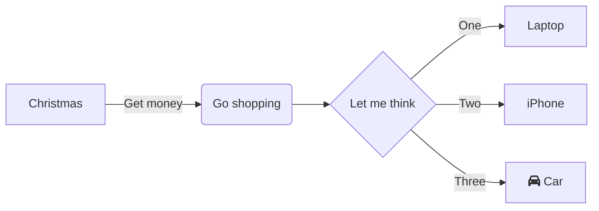

### Sequence

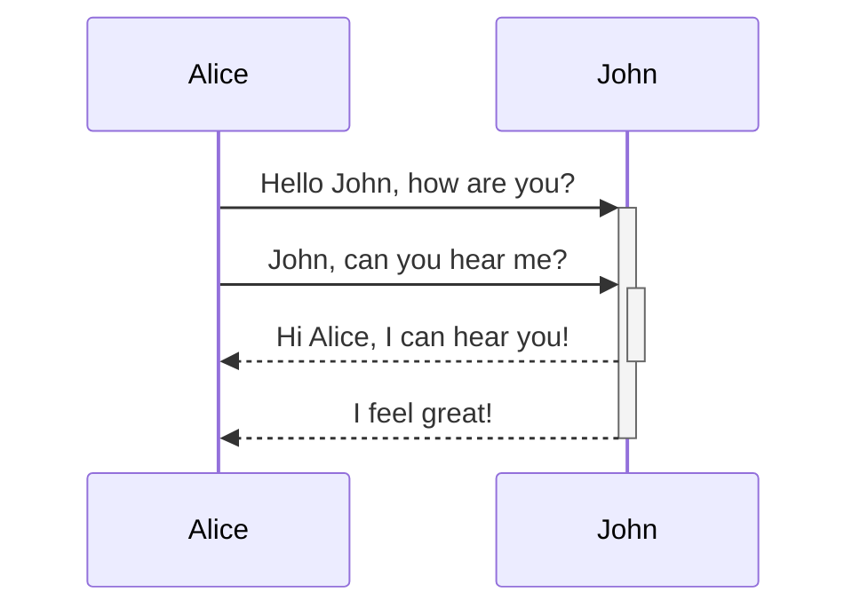

### Class

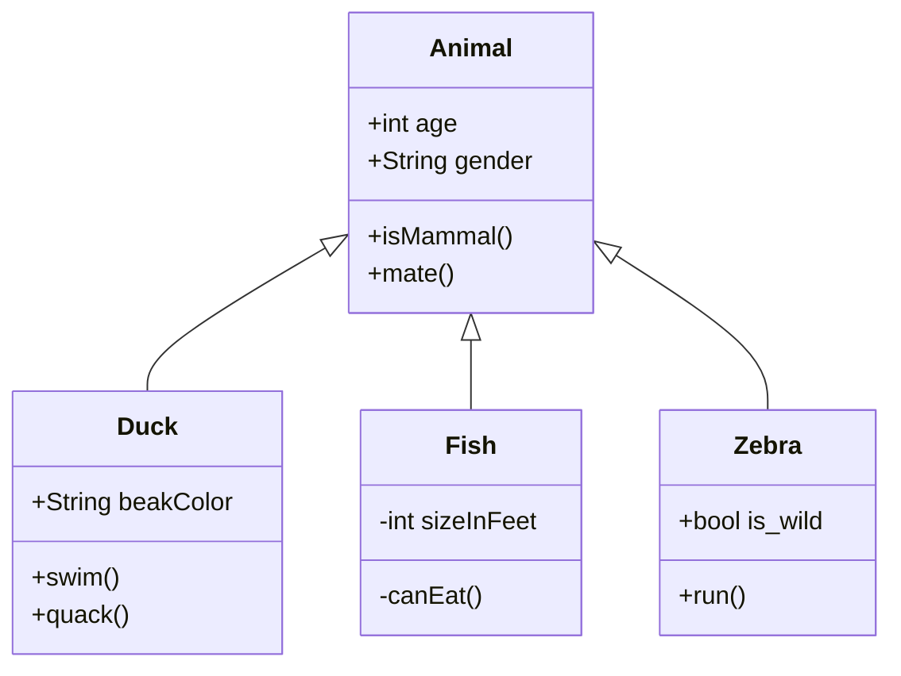

### State

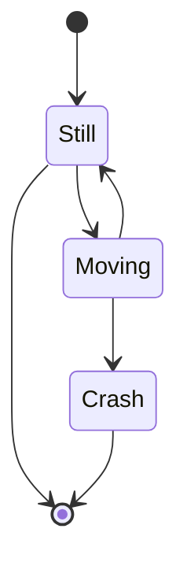

### User Journey

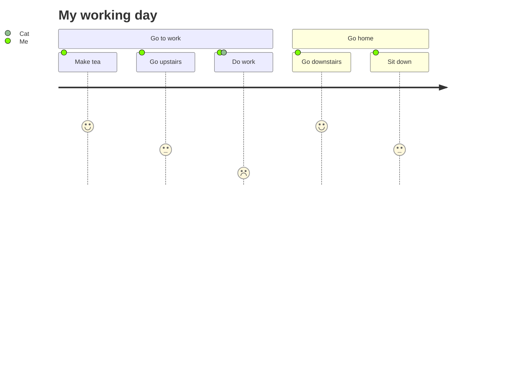

### Git

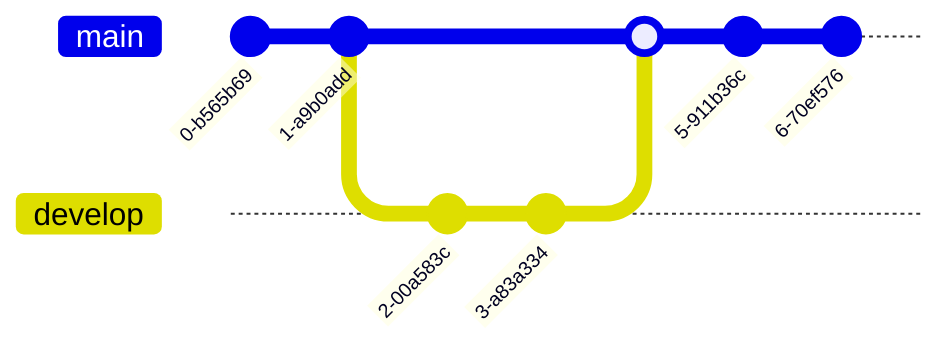

### Pie

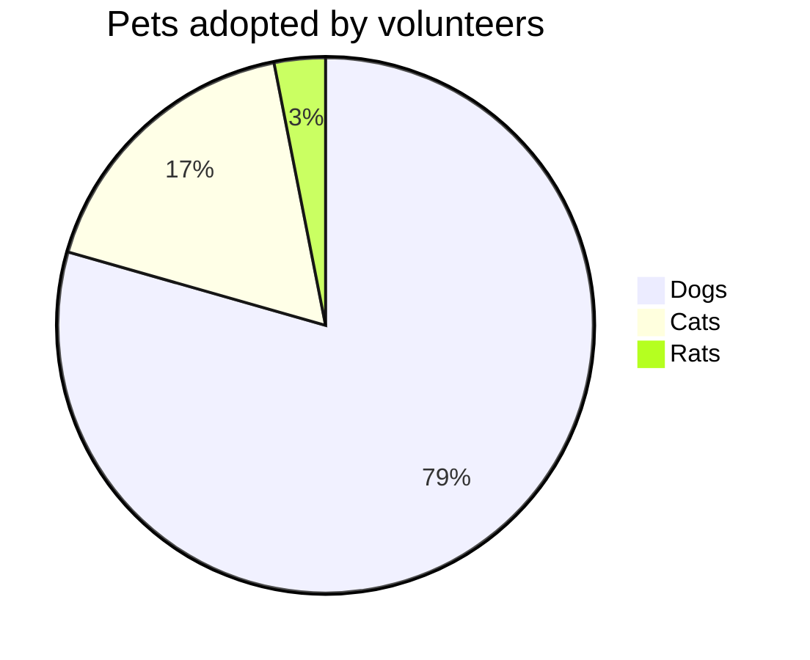

### Mindmap

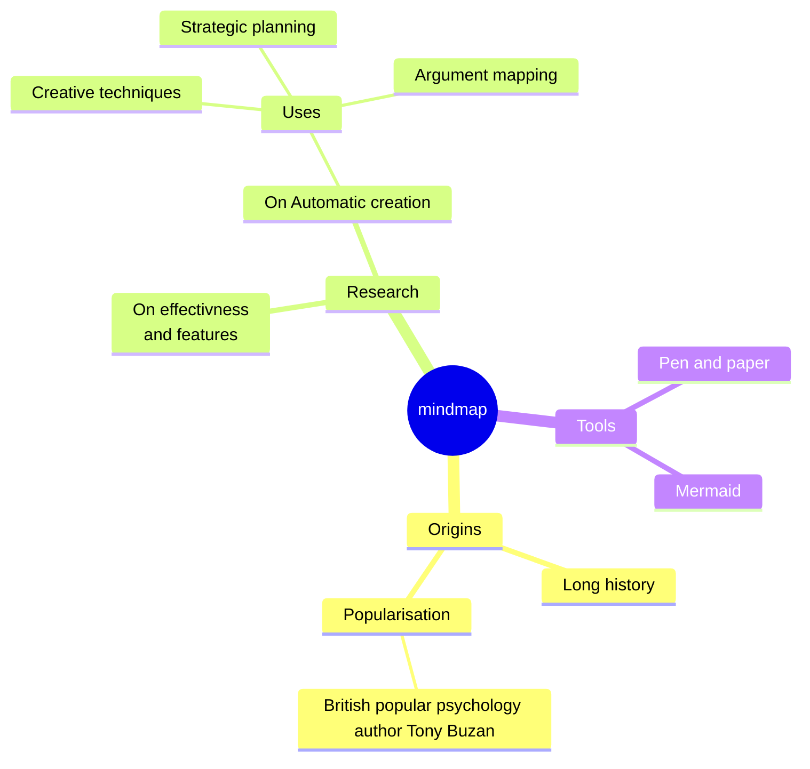

### Quadrant Chart

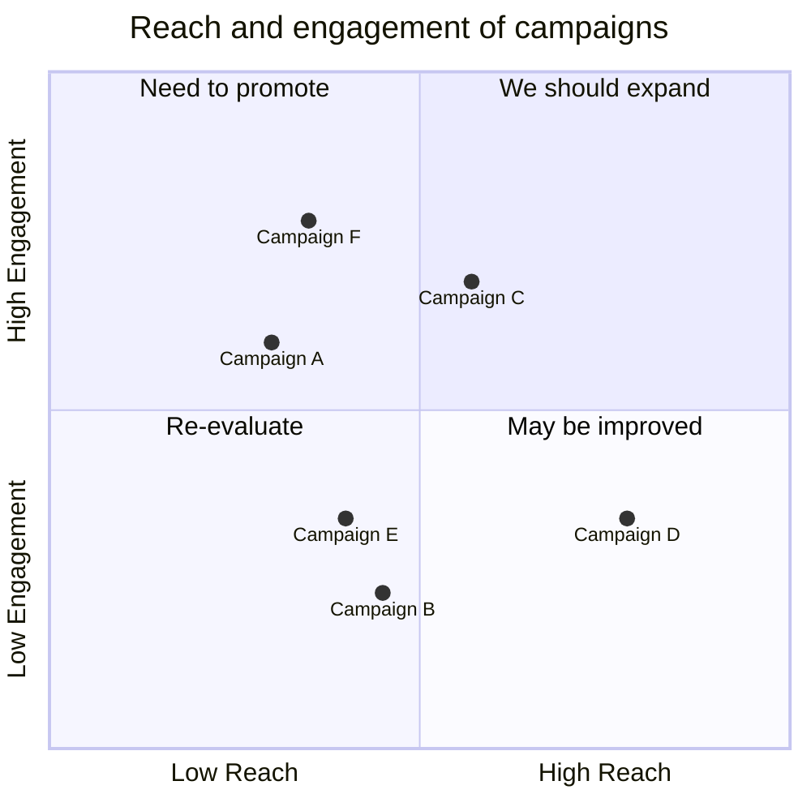

## Beta

### XY Chart

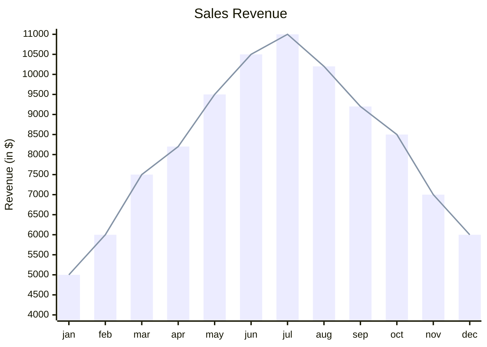

### Block

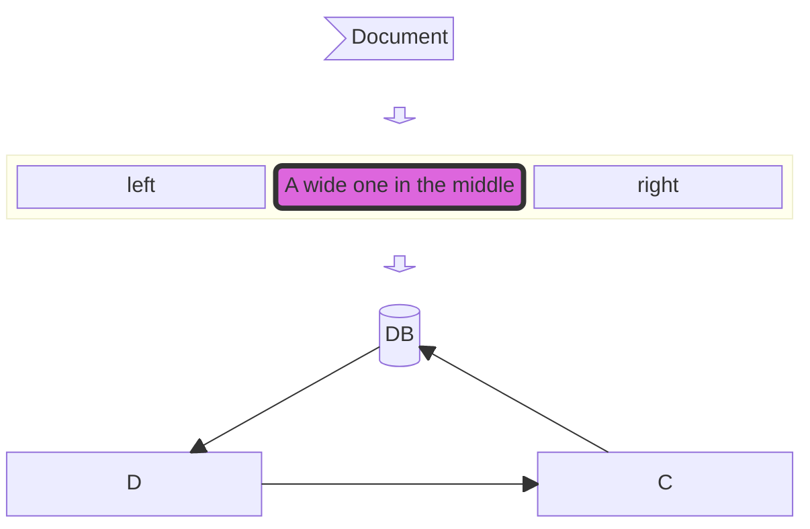
